# Convolutional Wasserstein GAN
### May 11th, 2018

## Description
Generative Adversarial Networks are a deep learning model architecture that fabricate realistic data in the image of a real data set.

The basic setup of a GAN consists of two networks. One of the two networks, known as the discriminator, tries to distinguish between real and generated images. The other network, known as the generator, generates images with the goal of fooling the first network. 

Wasserstein GANs use the Wassertein Distance as the optimization metric between real and generated distributions. This makes the GAN more stable during training, improves the diversity of the generated images, and reduces the sensitivity to hyperparameters. 

A reason for these benefits is that the Wasserstein Distance is continuous and defined even when the two distributions are equal to 0 (unlike the KL or JS Divergences and many others). This means that we can get a meaningful gradient even when the two distributions are completely different.

## WGAN Results
### CIFAR10
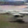

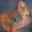
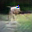
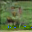
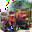

### German Traffic Signs
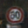

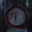
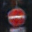
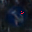
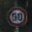

### MNIST
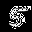
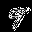
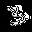
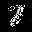
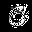
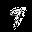
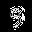

#### MNIST Loss Figures
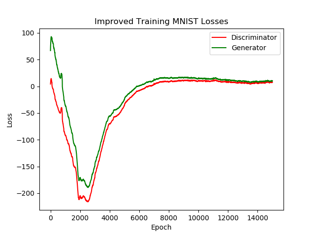
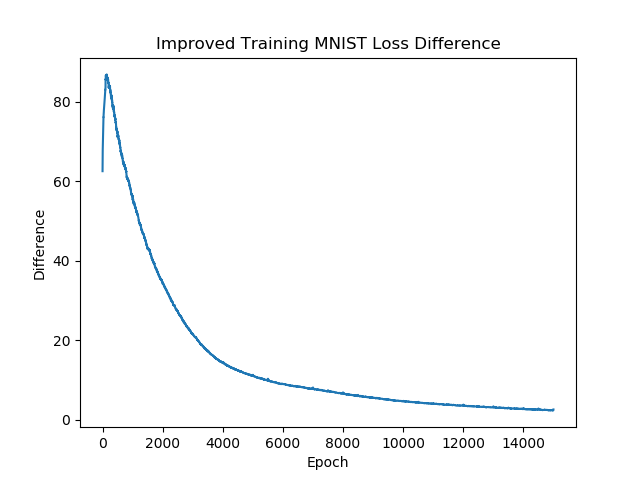

Loss difference is calculated as the difference between the loss from the real data and the loss from the generated data.

### Sources:
[Wasserstein GAN](https://arxiv.org/abs/1701.07875)
[Improved Training of Wasserstein GANs](https://arxiv.org/abs/1704.00028)
[Improved Training of Wasserstein GANs Github Repo](https://github.com/igul222/improved_wgan_training)
[Read-Through: Wasserstein GAN](https://www.alexirpan.com/2017/02/22/wasserstein-gan.html)
